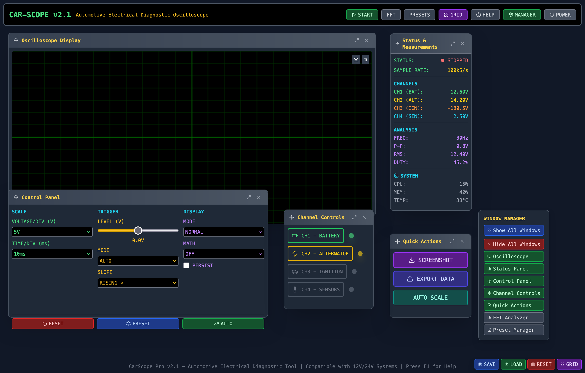

# CarScope - Automotive Electrical Diagnostic Oscilloscope

A modern, web-based oscilloscope application designed for automotive electrical diagnostics with advanced window management, draggable interfaces, and comprehensive analysis tools.



*CarScope Pro v2.1 - Professional Automotive Electrical Diagnostic Tool*

## Features

### 🚗 Automotive-Focused
- **Multi-channel support** (4 channels) for automotive electrical systems
- **Pre-configured presets** for common automotive tests:
  - Battery voltage monitoring
  - Alternator output analysis
  - Ignition system diagnostics
  - Full system diagnostic mode
- **12V/24V system compatibility**

### 🖥️ Advanced Window Management
- **Draggable windows** - Move any panel to your preferred position
- **Resizable windows** - Adjust window sizes by dragging the bottom-right corner
- **Resize-to-content** - Automatically resize windows to fit their content exactly
- **Window close functionality** - Close individual windows as needed
- **Draggable window manager panel** - Move the window management panel anywhere on screen
- **Layout persistence** - Window positions and sizes are automatically saved
- **Focus management** - Click any window to bring it to front
- **Responsive design** - Works on different screen sizes

### 📊 Advanced Analysis
- **Real-time oscilloscope display** with multiple display modes
- **FFT (Fast Fourier Transform) analyzer** for frequency domain analysis
- **Multiple trigger modes** (Auto, Normal, Single)
- **Math functions** (Add, Subtract, Multiply)
- **Persistence mode** for signal analysis
- **Auto-scale functionality** for optimal signal display

### 💾 Data Management
- **Preset system** - Save and load common configurations
- **Screenshot capability** - Capture oscilloscope displays
- **Layout persistence** - Window positions and sizes are automatically saved
- **Export functionality** - Save measurement data
- **Window manager position saving** - Remembers window manager panel position

## Window Management

### Available Windows
1. **Oscilloscope Display** - Main waveform visualization with real-time updates
2. **Status & Measurements** - Real-time measurements and system status
3. **FFT Analyzer** - Frequency domain analysis with channel selection
4. **Preset Manager** - Save and load configurations
5. **Control Panel** - Oscilloscope settings and controls
6. **Channel Controls** - Individual channel settings and visibility
7. **Quick Actions** - Common operations (screenshot, export, auto-scale)

### Window Controls
- **Drag**: Click and drag the window header to move windows
- **Resize**: Drag the bottom-right corner to resize windows
- **Resize to Content**: Click the maximize icon (↗) to resize window to fit content exactly
- **Close**: Click the X button in the window header (for FFT and Preset windows)
- **Focus**: Click anywhere on a window to bring it to front

### Window Manager Panel
- **Location**: Draggable panel in top-left corner (can be moved anywhere)
- **Individual toggles**: Show/hide each window independently
- **Bulk operations**: "Show All Windows" and "Hide All Windows" buttons
- **Visual feedback**: Green buttons for visible windows, gray for hidden
- **Position persistence**: Panel position is saved and restored

### Layout Management
- **Save Layout**: Click the "SAVE" button to save current window positions and sizes
- **Load Layout**: Click the "LOAD" button to restore the last saved layout
- **Reset Layout**: Click the "RESET" button to restore default window positions
- **Grid Layout**: Click the "GRID" button to arrange windows in an organized grid

## Getting Started

### Prerequisites
- Node.js 18.18.0 or higher
- npm or yarn

### Installation
```bash
# Clone the repository
git clone <repository-url>
cd car-scope

# Install dependencies
npm install

# Start development server
npm run dev
```

### Usage
1. **Power On**: Click the "POWER ON" button to start the application
2. **Window Management**: Use the Window Manager panel to show/hide windows
3. **Start Acquisition**: Click "START" to begin signal acquisition
4. **Configure Channels**: Use the Channel Controls window to enable/disable channels
5. **Adjust Settings**: Use the Control Panel to modify oscilloscope parameters
6. **Analyze Signals**: Use the FFT Analyzer for frequency domain analysis
7. **Save Presets**: Use the Preset Manager to save common configurations
8. **Resize Windows**: Use the resize-to-content button for optimal window sizing

## Top Menu Controls

### Header Buttons
- **START/STOP**: Toggle oscilloscope acquisition
- **FFT**: Toggle FFT Analyzer window
- **PRESETS**: Toggle Preset Manager window
- **GRID**: Arrange all windows in a grid layout
- **HELP**: Show keyboard shortcuts and help information
- **MANAGER**: Toggle the Window Manager panel visibility
- **POWER**: Power off the application

### Window Manager Panel
- **Show All Windows**: Display all main windows
- **Hide All Windows**: Hide all windows
- **Individual Window Toggles**: Control each window independently

## Keyboard Shortcuts
- **Space**: Start/Stop acquisition
- **Ctrl+S**: Take screenshot
- **C**: Toggle cursors
- **R**: Reset to default settings
- **F1**: Show help

## Technical Details

### Built With
- **React 18** - UI framework with hooks
- **TypeScript** - Type safety and better development experience
- **Vite** - Fast build tool and dev server
- **Tailwind CSS** - Utility-first CSS framework
- **Lucide React** - Beautiful, customizable icons
- **Canvas API** - High-performance oscilloscope rendering

### Architecture
- **Component-based** architecture with reusable draggable windows
- **State management** using React hooks (useState, useEffect, useCallback)
- **Local storage** for persistent settings, layouts, and window positions
- **Canvas-based** oscilloscope and FFT rendering for optimal performance
- **ResizeObserver** for responsive canvas sizing
- **Event-driven** architecture for inter-component communication

### Key Components
- **DraggableWindow**: Core draggable and resizable window component
- **WindowManager**: Manages multiple windows and layout persistence
- **Oscilloscope**: Canvas-based waveform visualization
- **FFTAnalyzer**: Frequency domain analysis with real-time updates
- **ControlPanel**: Oscilloscope settings and controls
- **StatusPanel**: Real-time measurements and system information

### Browser Support
- **Chrome/Chromium** (recommended for best performance)
- **Firefox** (full support)
- **Safari** (full support)
- **Edge** (full support)

## Recent Updates

### Window Management Enhancements
- ✅ **Draggable Window Manager Panel** - Move the panel anywhere on screen
- ✅ **Resize-to-Content Button** - Automatically resize windows to fit content
- ✅ **Window Close Functionality** - Close individual windows
- ✅ **Position Persistence** - All window positions and sizes are saved
- ✅ **Enhanced Grid Layout** - Better window arrangement algorithm
- ✅ **Visual State Indicators** - Clear indication of window visibility

### Performance Improvements
- ✅ **Optimized Canvas Rendering** - Smooth real-time updates
- ✅ **Responsive Canvas Sizing** - Automatic canvas resizing
- ✅ **Efficient Event Handling** - Improved drag and resize performance
- ✅ **Memory Management** - Proper cleanup of event listeners

### User Experience
- ✅ **Professional UI Design** - Modern, automotive-themed interface
- ✅ **Intuitive Controls** - Easy-to-use window management
- ✅ **Visual Feedback** - Clear indication of window states
- ✅ **Keyboard Shortcuts** - Quick access to common functions

## License

This project is licensed under the MIT License - see the LICENSE file for details.

## Contributing

1. Fork the repository
2. Create a feature branch
3. Make your changes
4. Add tests if applicable
5. Submit a pull request

## Support

For issues and feature requests, please use the GitHub issue tracker.

---

**CarScope Pro v2.1** - Professional Automotive Electrical Diagnostic Tool 